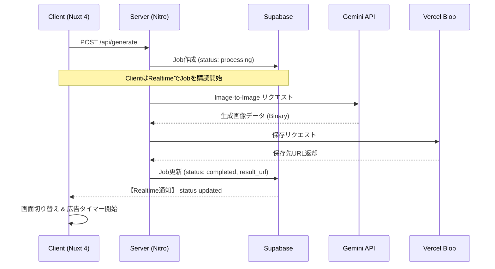

# API設計書：AIペットアイコンジェネレーター「AniMe」

## 1. 設計方針

* **セキュリティ:** Gemini API Key等の秘匿情報を保護するため、すべての画像生成処理は Nitro (Nuxt Server Engine) を経由する。
* **リアルタイム性:** Supabase Realtime を活用し、生成完了をフロントエンドへ即時通知する。
* **効率的なアップロード:** Vercel Blob SDK を使用し、サーバーサイドで生成した画像を直接ストレージへ転送する。

## 2. エンドポイント定義

### ① アイコン生成リクエスト

ユーザーが選択したスタイルと画像のURLを送り、生成プロセスを開始します。

* **Endpoint:** `POST /api/generate`
* **Auth:** 不要（`anon_session_id` を使用）
* **Request Body:**

  ```json
  {
    "anon_session_id": "string (UUID)",
    "source_image_url": "string (Vercel Blob URL)",
    "style_type": "3d-anime | watercolor | fluffy | cyberpunk | korean-style | simple-illustration"
  }
  ```

* **Response (202 Accepted):**

  ```json
  {
    "job_id": "string (UUID)",
    "status": "pending"
  }
  ```

### ② 広告視聴完了通知

広告が規定時間再生されたことをサーバーに記録し、ダウンロードを許可状態にします。

* **Endpoint:** `PATCH /api/jobs/:id/ad-complete`
* **Request Body:**

  ```json
  {
    "anon_session_id": "string (UUID)"
  }
  ```

* **Response (200 OK):**

  ```json
  {
    "success": true,
    "download_ready": true
  }
  ```

### ③ 画像アップロード用署名付きURL発行

クライアントが直接 Vercel Blob へ元画像をアップロードするための署名付きURLを取得します。

* **Endpoint:** `POST /api/upload/presign`
* **Request Body:**

  ```json
  {
    "filename": "pet.jpg",
    "contentType": "image/jpeg"
  }
  ```

* **Response (200 OK):**

  ```json
  {
    "uploadUrl": "string",
    "accessUrl": "string"
  }
  ```

### ④ フィードバック送信

ユーザーからのフィードバック（Good/Bad）を受け付けます。

* **Endpoint:** `POST /api/feedback`
* **Request Body:**

  ```json
  {
    "job_id": "string (UUID)",
    "anon_session_id": "string (UUID)",
    "feedback_type": "good | bad",
    "selected_style": "string (optional)",
    "free_text": "string (optional)"
  }
  ```

* **Response (200 OK):**

  ```json
  {
    "success": true
  }
  ```

## 3. 内部処理シーケンス



## 4. プロンプト制御ロジック (Internal)

`style_type` に基づき、Nitro内部で Gemini への命令文（System Instruction）を動的に切り替えます。

| Style Type | 内部プロンプト（英語） |
| ---------- | -------------------- |
| `3d-anime` | Transform this pet into a 3D Pixar-style animated character. High detail, soft fur, expressive eyes. |
| `watercolor` | Create a soft watercolor painting of this pet. Artistic splashes, pastel colors, white background. |
| `fluffy` | A cute, hand-drawn fluffy illustration. Warm and cozy vibes, simple lines. |
| `cyberpunk` | Cool cyberpunk pet icon. Neon lights, futuristic accessories, vibrant glowing colors. |
| `korean-style` | Create a modern Korean-style pet icon. Vibrant colors, smooth gradients, cute and charming design, popular K-pop aesthetic. |
| `simple-illustration` | Create a simple, minimalist pet icon. Clean lines, solid colors, white or transparent background, modern and versatile. |

## 5. エラーハンドリング

| Status | Error Code | Description / User Message |
| ------ | ---------- | -------------------------- |
| 429 | `RATE_LIMIT_EXCEEDED` | 「リクエストが多すぎます。しばらく待ってから再度お試しください。」 |
| 400 | `INVALID_IMAGE_FORMAT` | 「対応していない画像形式です。JPGまたはPNGを使用してください。」 |
| 400 | `IMAGE_TOO_LARGE` | 「画像は4.5MBまでです。別の写真を選んでください。」 |
| 422 | `CONTENT_POLICY_VIOLATION` | 「AIの安全ポリシーにより生成できませんでした。別の写真でお試しください。」 |
| 500 | `INTERNAL_SERVER_ERROR` | 「予期せぬエラーが発生しました。時間を置いてやり直してください。」 |
| 503 | `AI_SERVICE_UNAVAILABLE` | 「AIサーバーが一時的に混み合っています。時間を置いてやり直してください。」 |
